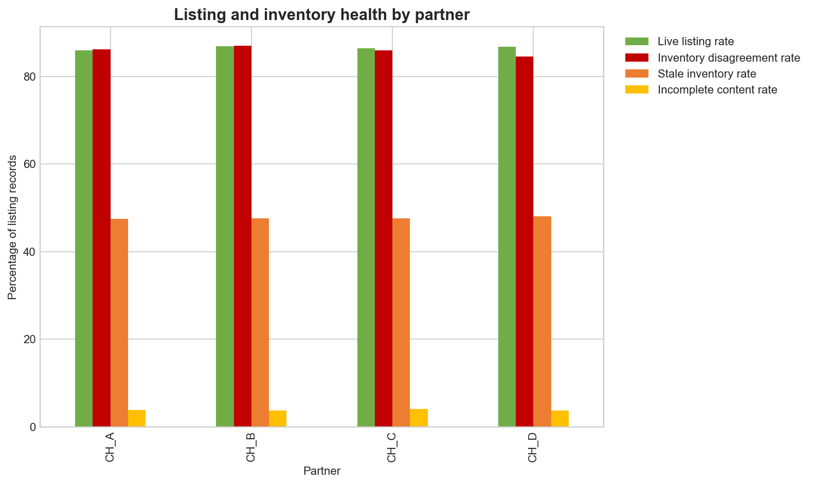
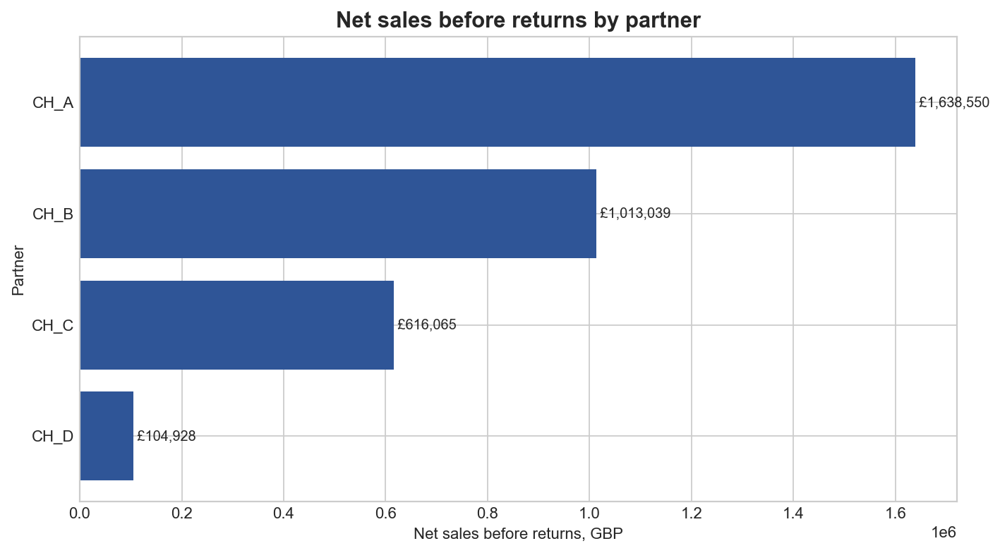
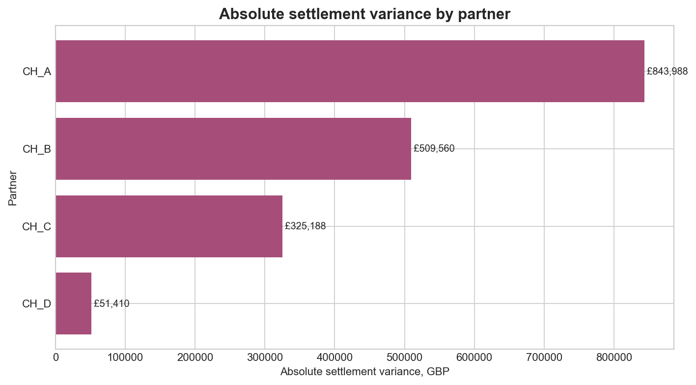
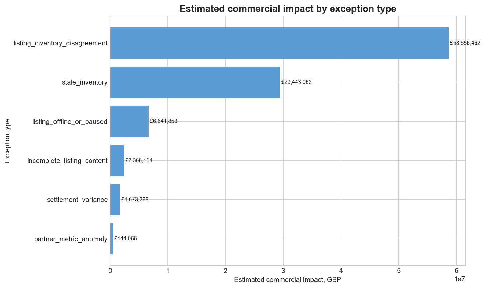

# Meridian — Partner Commerce Health & Settlement Reconciliation

An end-to-end third-party eCommerce analytics project built to explore how retailers can integrate partner marketplace data, monitor product availability, reconcile financial settlements, prioritise operational exceptions, and use AI to support issue classification.

The project uses **Python, SQL, Databricks and PySpark** to transform multiple partner data sources through a **Bronze–Silver–Gold architecture**, producing business-ready datasets for analysis and Power BI reporting.

> **Note:** Meridian is a portfolio project built using entirely synthetic data. It does not contain data from any real retailer, marketplace or commercial partner.

---

## Business Problem

Retailers selling products through external eCommerce partners need to manage data coming from multiple systems and formats.

Operational teams need to answer questions such as:

- Are products correctly mapped between internal and partner systems?
- Which products are offline or unavailable despite having stock?
- Are partner feeds complete, current and reliable?
- Do reported settlements match expected commercial values?
- Which issues have the greatest potential business impact?
- Can repetitive exception triage be supported using AI?

Meridian was designed as a simplified analytics environment for investigating these problems across the partner-commerce lifecycle.

---

## What I Built

The project covers data from:

- Partner product listings
- Inventory snapshots
- Order headers and order lines
- Shipment events
- Returns
- Settlement lines
- Payout batches
- Daily FX rates
- Partner, country and product reference data
- Partner-to-internal product/SKU mappings

These sources are integrated into a structured analytical pipeline for data-quality monitoring, commerce performance analysis, financial reconciliation and operational exception management.

---

## Architecture

```text
Synthetic Partner & Internal Data
              │
              ▼
        BRONZE LAYER
     Raw source ingestion
              │
              ▼
        SILVER LAYER
 Cleaning • Standardisation
 Validation • Data Mapping
 Quarantine • Reconciliation
              │
              ▼
         GOLD LAYER
 Partner Performance Metrics
 Listing & Inventory Health
 Settlement Reconciliation
 Anomaly Detection
 Exception Management
              │
        ┌─────┴─────┐
        ▼           ▼
 Business/SQL    AI-Assisted
   Analysis      Classification
        │
        ▼
 Power BI-ready Reporting
```

---

## Bronze → Silver → Gold

### Bronze — Raw Ingestion

The Bronze layer preserves the original source structure of the synthetic partner feeds.

Nine operational datasets are ingested covering:

`Listings` • `Inventory` • `Orders` • `Order Lines` • `Shipments` • `Returns` • `Settlements` • `Payouts` • `FX Rates`

This creates a raw landing layer before transformation or business rules are applied.

### Silver — Cleaning, Mapping & Validation

The Silver layer prepares the partner data for analysis by:

- Standardising schemas and data types
- Parsing and validating dates
- Mapping external partner identifiers to internal references
- Standardising partner, country and product/SKU relationships
- Applying data-quality rules
- Separating problematic records through quarantine logic
- Preparing datasets for downstream reconciliation and analysis

This layer represents the transition from externally supplied data to internally usable analytical data.

### Gold — Business Analytics

The Gold layer converts the validated data into business-facing analytical outputs, including:

- Order metrics
- Partner daily performance
- Listing health
- Settlement reconciliation
- Unallocated settlements
- Partner metric anomalies
- Operational exception queues

These tables provide the analytical foundation for reporting and operational decision-making.

---

## Data Quality & Partner Mapping

A key part of the project is resolving the relationship between external partner data and internal business data.

Reference datasets are used for:

- Partner mapping
- Country mapping
- Internal product references
- Partner-to-internal product/SKU mapping

Validation and quarantine rules prevent problematic records from silently entering downstream reporting.

This creates a controlled path from raw third-party feeds to trusted analytical datasets.

---

## Listing & Inventory Health

The project analyses product availability and listing behaviour to identify operational issues that could affect whether a product can be sold.

Examples include:

- Listing availability problems
- Inventory inconsistencies
- Mapping failures
- Stale partner information
- Product-data issues

The resulting listing-health dataset provides a structured way to identify products requiring investigation.



---

## Partner Sales Performance

Partner-level metrics provide a consolidated view of commerce performance across the synthetic partner network.

The analytical layer supports comparison of sales and operational performance between partners and provides reusable data for downstream reporting.



---

## Settlement Reconciliation

The financial reconciliation workflow compares **expected settlement values with partner-reported settlement data**.

The process identifies:

- Matched settlements
- Settlement variances
- Unallocated settlement records
- Financial exceptions requiring investigation

Where required, synthetic FX data is used to standardise monetary values into **GBP** for consistent comparison.



---

## Commercial Exception Prioritisation

Detecting an issue is only useful if an operational team can determine what to investigate first.

Meridian therefore consolidates operational issues into a structured exception-management workflow.

The complete exception queue contains:

**162,235 exception records**

Exceptions are prioritised using factors including:

- Issue severity
- Operational status
- Estimated commercial impact in GBP

This allows potentially business-critical problems to be surfaced ahead of lower-impact issues.



---

## AI-Assisted Exception Classification

To explore how AI could support operational workflows, I added an AI-assisted classification stage using Databricks `ai_classify`.

The model was applied to:

**250 high/medium-severity open exceptions**

Classification results:

| Suggested category | Exceptions |
|---|---:|
| Inventory availability | 235 |
| Catalog/content | 15 |
| **Total** | **250** |

The AI output is deliberately **advisory rather than autonomous**.

The original deterministic `issue_type` is retained, while the AI-generated category is stored separately as `ai_suggested_category`.

Every AI-classified record remains:

**`pending_human_review`**

The AI does not automatically close, resolve or reassign operational exceptions. This design keeps human oversight within the decision-making process while demonstrating how AI could accelerate repetitive triage.

---

## Business Analysis

The project also includes a separate analytical workflow examining:

- Partner performance
- Listing health
- Settlement reconciliation
- Commercial exception priority

Reusable SQL outputs were produced to separate analytical logic from presentation and make the results easier to consume downstream.

---

## Power BI-ready Reporting

The Gold datasets were transformed into reporting-ready fact and dimension tables for Power BI.

Prepared datasets cover:

- Date
- Partner
- Country
- Product
- Order metrics
- Partner daily metrics
- Listing health
- Settlement reconciliation
- Exception management

A measure catalogue and relationship definitions were also prepared to support development of the reporting model.

> The repository currently contains Power BI-ready analytical outputs; the Power BI dashboard itself is not presented as a completed project deliverable.

---

## Tech Stack

| Area | Technology |
|---|---|
| Programming | Python |
| Data Manipulation | Pandas |
| Querying | SQL |
| Data Platform | Databricks |
| Distributed Processing | PySpark |
| Architecture | Bronze / Silver / Gold |
| AI | Databricks `ai_classify` |
| Reporting Preparation | Power BI-ready data model |
| Development | Jupyter Notebook |

---

## Repository Structure

```text
meridian-partner-commerce-analytics/
│
├── README.md
│
├── notebooks/
│   ├── 01_syndata.ipynb
│   └── 02_business_analysis_and_kpis.ipynb
│
├── databricks/
│   ├── 01_bronze_ingestion.dbc
│   ├── 02_silver_transformations.dbc
│   └── 03_gold_analytics.dbc
│
└── output/
    ├── chart_partner_sales.png
    ├── chart_listing_health.png
    ├── chart_settlement_variance.png
    └── chart_exception_impact.png
```

---

## Project Scope

Meridian was developed as a **portfolio case study**, not as a production commerce system.

All companies, partners, transactions, products and financial records represented in the project are synthetic.

The objective was to demonstrate an end-to-end approach to working with third-party commerce data:

**ingestion → validation → mapping → transformation → reconciliation → prioritisation → analysis → reporting**

The project particularly focuses on the point where technical data processing meets a business requirement: turning fragmented partner data into information that can help teams identify problems, understand commercial impact and decide where to act first.
